# FreelanceFusion features
Detailed description of supported features and their contributors.

## Summary
| Feature | Brief Description | Contributors |
|:---|:---|:---|
| [Profile management](#profile-management) | View and update profile | Alice Tat
| [Ratings and reviews](#ratings-and-reviews) | - Client: View, add, delete ratings and reviews  - Freelacner: View received ratings and receive real-time notification | Alice Tat
| [Search function](#search-function) | Search job, search freelancer | Tuan Phong Nguyen
| [Project Management](#project-management) | - Freelancer and Client: Manage projects and real-time updated tasks  - Client: add or remove freelancer from current project | Tuan Phong Nguyen
| [User authentication](#user-authentication) | Register and login | Caroline Nguyen   Sumedh Vartak
| [Real-time communication](#real-time-communication) | Real-time chat between freelancer and client | Caroline Nguyen   Sumedh Vartak   Misa Aghera
| [Job board](#job-board) | - Client: View all posted jobs, post new job, edit posted jobs   - Freelancer: Apply for a job | Misa Aghera

## Profile management
This feature include view and update profile.
- View profile detail
  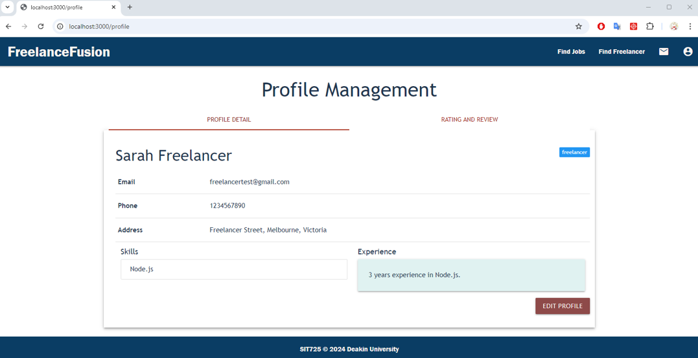
- Edit profile detail
  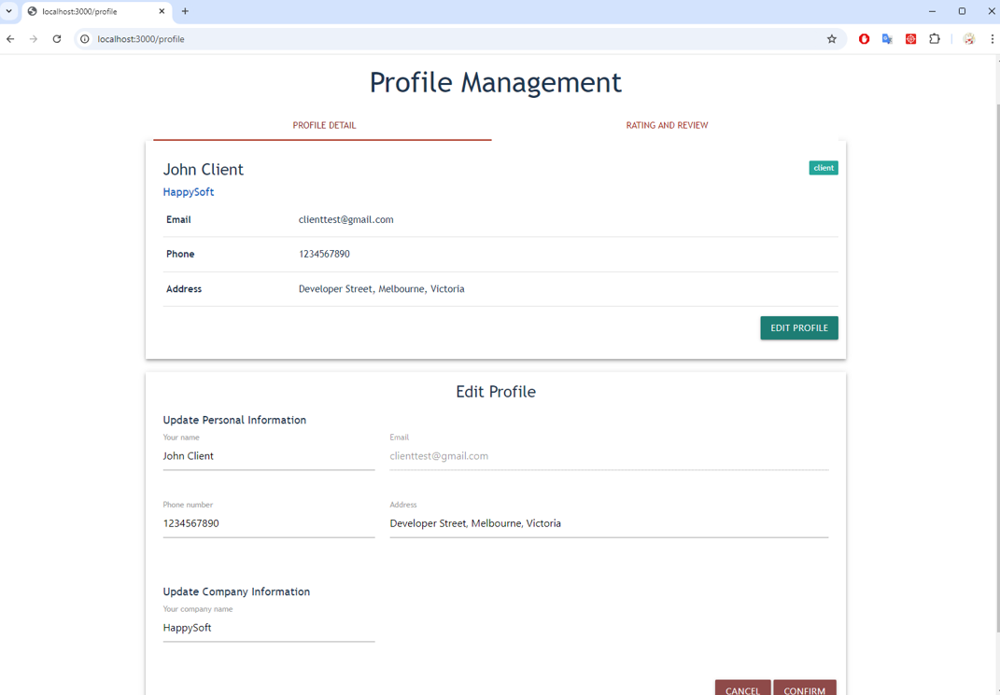

[Back to top](#table-of-contents)

## Ratings and reviews
This feature has some differences between client and freelancer.
- As a client: 
  - Delete your ratings and reviews
  - View your given ratings and reviews
  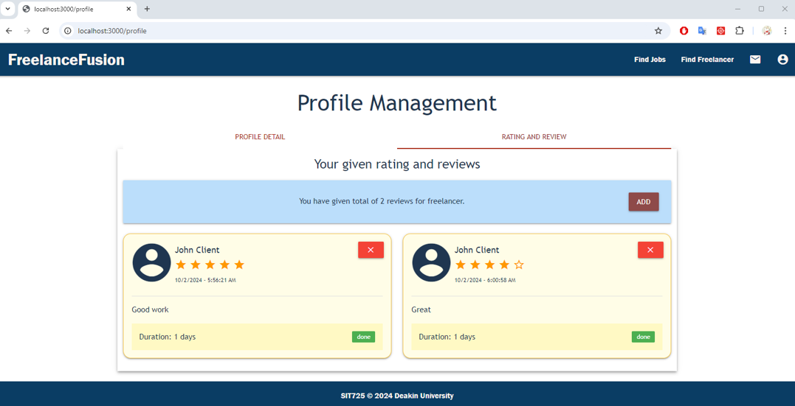
  - Add your new ratings and reviews
  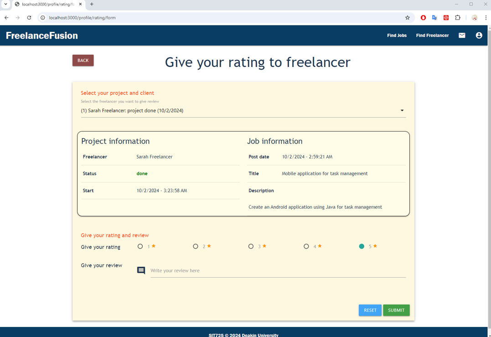
- As a freelancer:
  - View your received ratings and overall points
  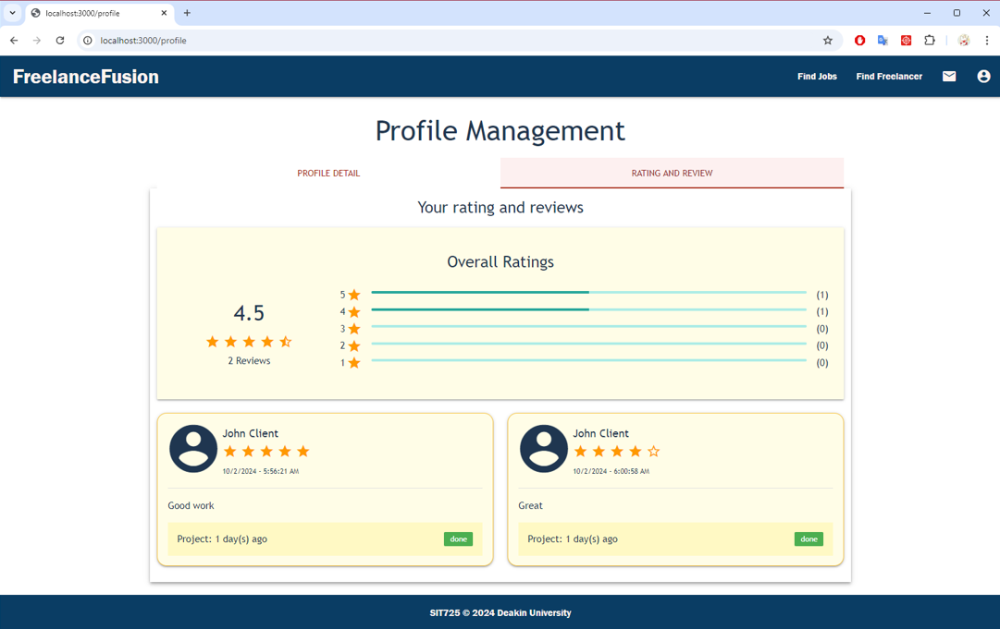
  - Real-time notification is sent to target freelancer immediately when a new rating is added for them
  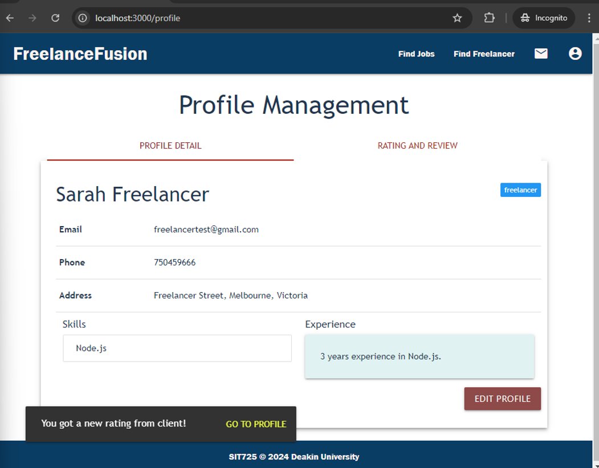

[Back to top](#table-of-contents)

## Search function
This feature include search job, search freelancer.
- Search job
  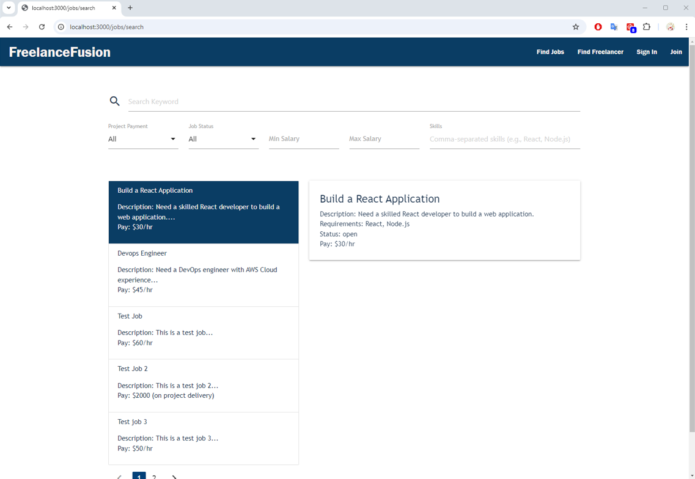
- Search freelancer
  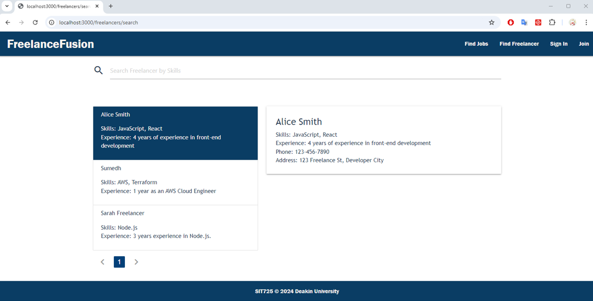

[Back to top](#table-of-contents)

## Project Management
This feature is shared between client and freelancer, both can manage the project with tasks on boards (To-do, In progress and Completed). Tasks are real-time sync between client and freelancer.

For client, there are some extra features such as:
  - Accept application from freelancer
  - Remove freelancer from current project

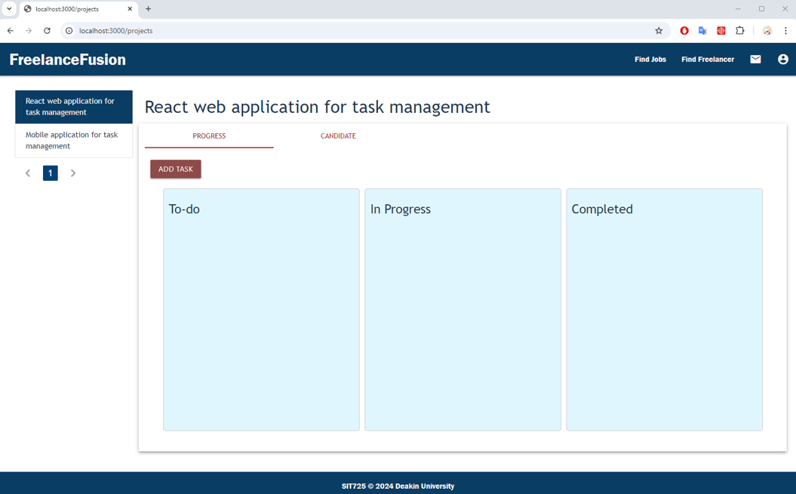
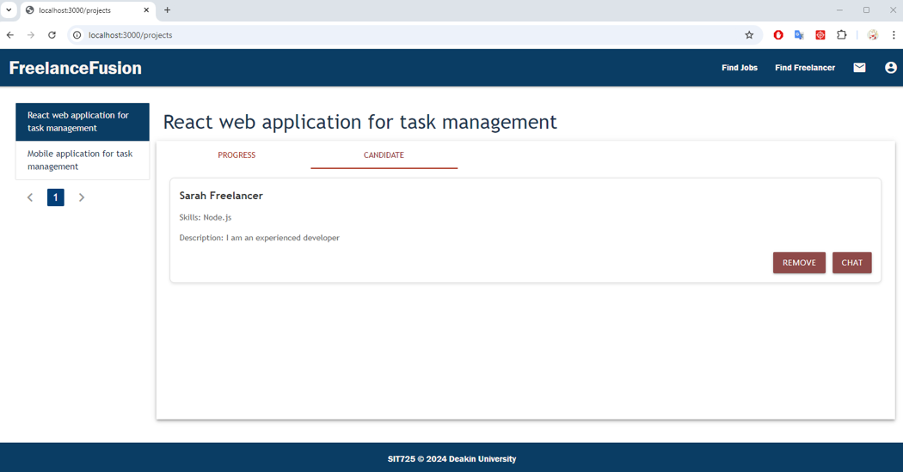

[Back to top](#table-of-contents)

## User authentication
This feature include register and login.
- Register (Sign Up)
  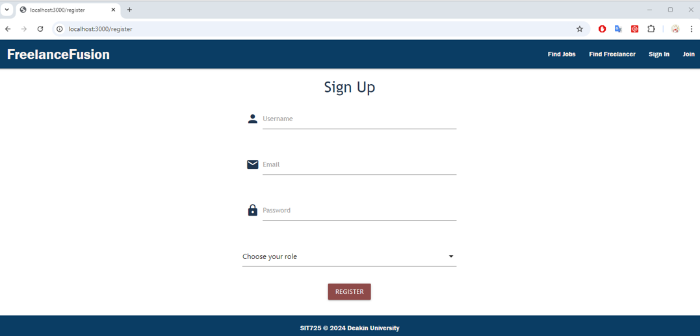
- Login (Sign In)
  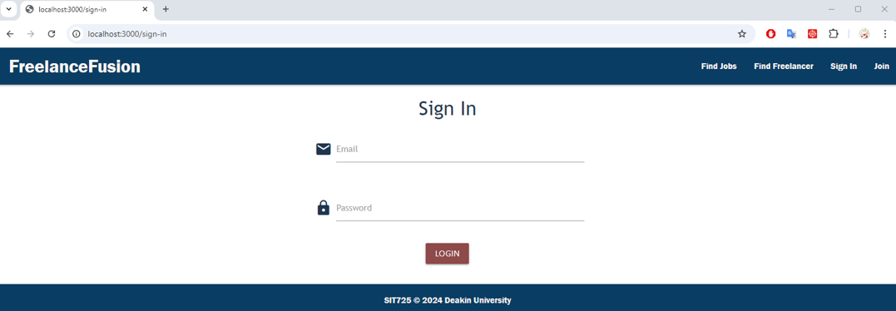

[Back to top](#table-of-contents)

## Real-time communication
This feature allows real-time chat between freelancer and client.

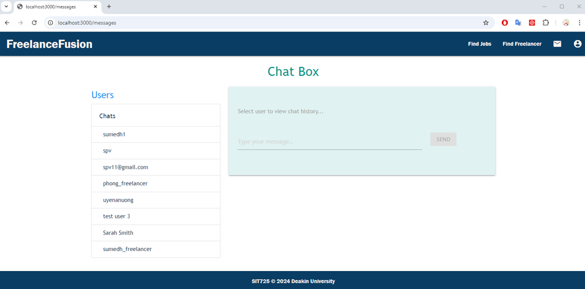

[Back to top](#table-of-contents)

## Job board
This feature include different features based on account type:
- Freelancer can apply for a job after searching for a suitable one with freelancer account.
- Client can view all posted jobs, edit posted jobs, and post new job to job board.

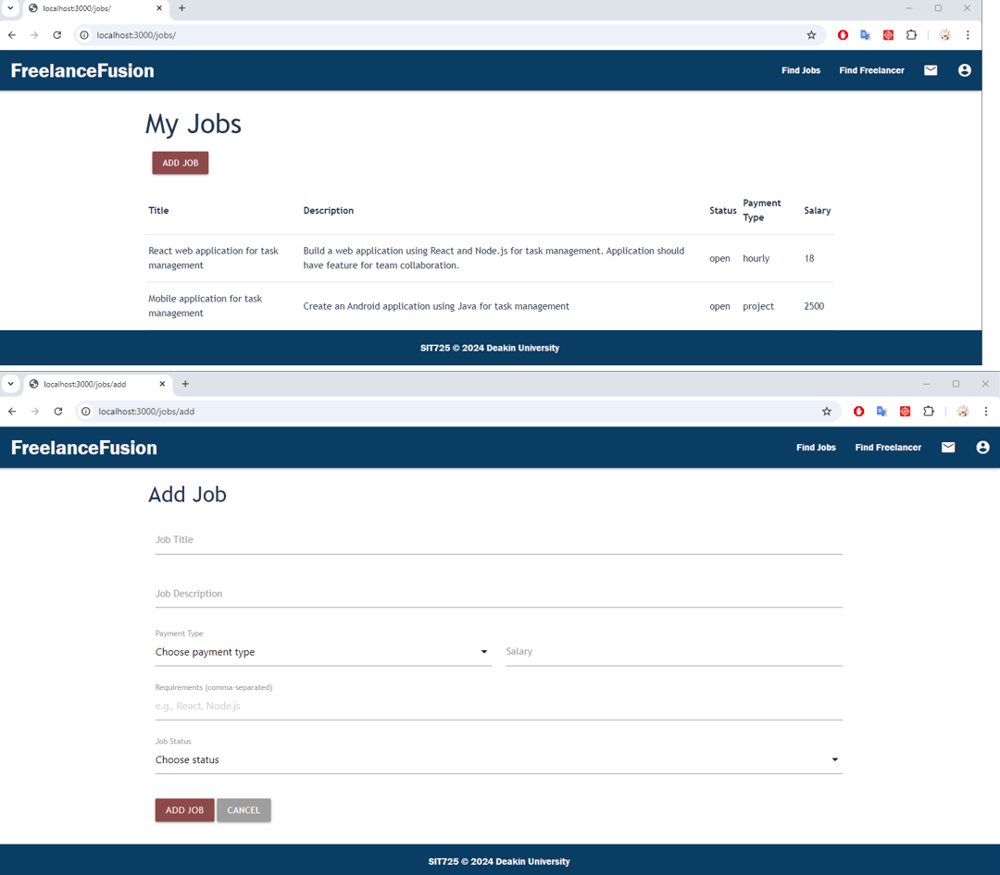

[Back to top](#table-of-contents)